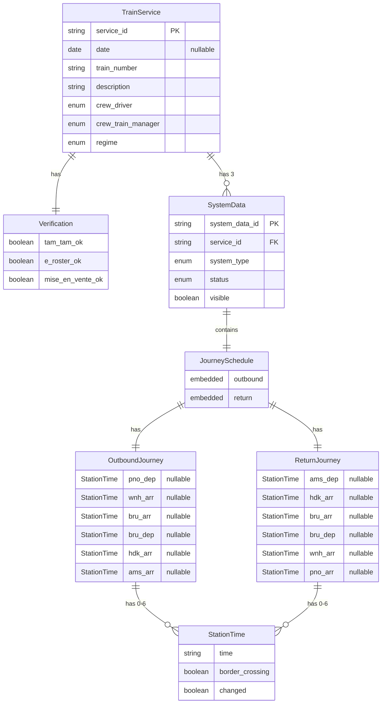
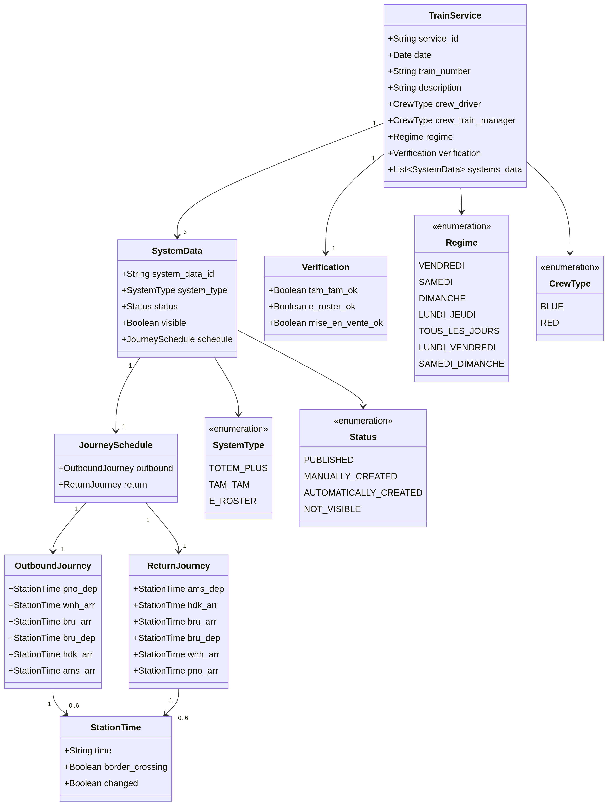
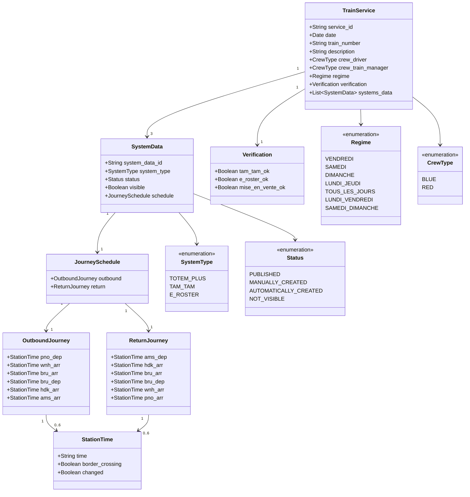

# Train Service Tracking Tool - Data Model & Entity Relationships

**Document Version:** 1.0  
**Last Updated:** November 11, 2025  
**Author:** Manus AI

---

## Purpose

This document provides a comprehensive, technology-agnostic specification of the data model for the Train Service Tracking Tool. Development teams can use this specification to implement the data layer in any programming language, database system, or framework of their choice.

---

## Core Entities

### 1. TrainService

The central entity representing a single train service operation on a specific date.

**Entity Properties:**

| Property | Type | Required | Description |
|----------|------|----------|-------------|
| service_id | String (UUID/GUID) | Yes | Unique identifier for the service instance |
| date | Date (nullable) | No | Operational date in YYYY-MM-DD format. Null for régimé template services |
| train_number | String | Yes | Train identification number (e.g., "9320", "9339") |
| description | String | No | Human-readable description of the service |
| crew_driver | Enum | Yes | Driver crew type: "Blue" or "Red" |
| crew_train_manager | Enum | Yes | Train manager crew type: "Blue" or "Red" |
| regime | Enum | Yes | Operational régime classification |

**Régime Enumeration Values:**
- `VENDREDI` - Friday services
- `SAMEDI` - Saturday services
- `DIMANCHE` - Sunday services
- `LUNDI_JEUDI` - Monday through Thursday services
- `TOUS_LES_JOURS` - Daily services
- `LUNDI_VENDREDI` - Monday through Friday services
- `SAMEDI_DIMANCHE` - Weekend services

**Business Rules:**
- `service_id` must be globally unique across all services
- `date` is null only for régimé template services (reference schedules)
- `train_number` can repeat across different dates but should be unique per date
- `regime` is derived from the service's operational pattern or explicitly set

---

### 2. SystemData

Represents schedule information from a single external system (Totem+, Tam Tam, or eRoster).

**Entity Properties:**

| Property | Type | Required | Description |
|----------|------|----------|-------------|
| system_data_id | String (UUID/GUID) | Yes | Unique identifier for this system data record |
| service_id | String (Foreign Key) | Yes | References parent TrainService |
| system_type | Enum | Yes | Which system this data comes from |
| status | Enum | Yes | Publication/creation status |
| visible | Boolean | Yes | Whether this data is visible in the system |
| schedule | JourneySchedule (embedded) | Yes | Complete journey schedule object |

**SystemType Enumeration:**
- `TOTEM_PLUS` - Authoritative source of truth
- `TAM_TAM` - Crew scheduling system
- `E_ROSTER` - Electronic rostering system

**Status Enumeration:**
- `PUBLISHED` - Officially published schedule
- `MANUALLY_CREATED` - Created by manual entry
- `AUTOMATICALLY_CREATED` - Generated automatically
- `NOT_VISIBLE` - Hidden from public view

**Relationships:**
- Each TrainService has exactly 3 SystemData records (one per system type)
- SystemData belongs to exactly one TrainService

---

### 3. JourneySchedule

Embedded object containing complete outbound and return journey information.

**Structure:**

```
JourneySchedule {
  outbound: OutboundJourney
  return: ReturnJourney
}
```

**Business Rules:**
- A service may have outbound only, return only, or both
- Empty journey is represented by all station times being null/undefined
- Station times are optional to support partial journeys

---

### 4. OutboundJourney

Represents the outbound journey from PNO (Perrache) to AMS (Amsterdam).

**Entity Properties:**

| Property | Type | Required | Description |
|----------|------|----------|-------------|
| pno_dep | StationTime (nullable) | No | Departure from Perrache |
| wnh_arr | StationTime (nullable) | No | Arrival at Weinheim (border crossing) |
| bru_arr | StationTime (nullable) | No | Arrival at Brussels |
| bru_dep | StationTime (nullable) | No | Departure from Brussels |
| hdk_arr | StationTime (nullable) | No | Arrival at Hoek van Holland (border crossing) |
| ams_arr | StationTime (nullable) | No | Arrival at Amsterdam |

**Station Sequence:**
PNO → WNH → BRU → HDK → AMS

**Border Crossings:**
- WNH (Weinheim) - France/Belgium border
- HDK (Hoek van Holland) - Belgium/Netherlands border

---

### 5. ReturnJourney

Represents the return journey from AMS (Amsterdam) to PNO (Perrache).

**Entity Properties:**

| Property | Type | Required | Description |
|----------|------|----------|-------------|
| ams_dep | StationTime (nullable) | No | Departure from Amsterdam |
| hdk_arr | StationTime (nullable) | No | Arrival at Hoek van Holland (border crossing) |
| bru_arr | StationTime (nullable) | No | Arrival at Brussels |
| bru_dep | StationTime (nullable) | No | Departure from Brussels |
| wnh_arr | StationTime (nullable) | No | Arrival at Weinheim (border crossing) |
| pno_arr | StationTime (nullable) | No | Arrival at Perrache |

**Station Sequence:**
AMS → HDK → BRU → WNH → PNO

**Border Crossings:**
- HDK (Hoek van Holland) - Netherlands/Belgium border
- WNH (Weinheim) - Belgium/France border

---

### 6. StationTime

Value object representing a single station timing with metadata.

**Entity Properties:**

| Property | Type | Required | Description |
|----------|------|----------|-------------|
| time | String (HH:MM) | Yes | Time in 24-hour format (e.g., "13:18") |
| border_crossing | Boolean | No | True if this station is at an international border |
| changed | Boolean | No | True if this time was modified from original schedule |

**Validation Rules:**
- `time` must match format `HH:MM` where HH is 00-23 and MM is 00-59
- `border_crossing` defaults to false if not specified
- `changed` defaults to false if not specified

**Visual Indicators:**
- `border_crossing = true` → Display in red italic text
- `changed = true` → Display with yellow text on dark background
- Both false → Display in normal white text

---

### 7. Verification

Embedded object containing verification status for all external systems.

**Entity Properties:**

| Property | Type | Required | Description |
|----------|------|----------|-------------|
| tam_tam_ok | Boolean | Yes | True if Tam Tam matches Totem+ |
| e_roster_ok | Boolean | Yes | True if eRoster matches Totem+ |
| mise_en_vente_ok | Boolean | Yes | True if service is available for ticket sales |

**Verification Logic:**

**tam_tam_ok Determination:**
1. If Tam Tam has no schedule data (all times null) → `false` (missing data)
2. If any station time differs from Totem+ → `false` (discrepancy)
3. If all station times match Totem+ → `true` (verified)

**e_roster_ok Determination:**
1. If eRoster has no schedule data (all times null) → `false` (missing data)
2. If any station time differs from Totem+ → `false` (discrepancy)
3. If all station times match Totem+ → `true` (verified)

**mise_en_vente_ok Determination:**
- Set externally based on ticket sales system availability
- Independent of schedule verification

**Relationships:**
- Each TrainService has exactly one Verification record
- Verification belongs to exactly one TrainService

---

## Entity Relationship Diagram




---

## Data Model Diagram (Class Diagram)





---

## Sample Data Structure (JSON)

### Complete Service Example

```json
{
  "service_id": "srv-20250620-9339",
  "date": "2025-06-20",
  "train_info": {
    "train_number": "9339",
    "description": "Blue train with mixed crew - Full journey",
    "crew": {
      "driver": "Blue",
      "train_manager": "Red"
    }
  },
  "regime": "VENDREDI",
  "systems_data": {
    "totem_plus": {
      "status": "PUBLISHED",
      "visible": true,
      "schedule": {
        "outbound": {
          "pno_dep": { "time": "12:22", "border_crossing": false, "changed": false },
          "wnh_arr": { "time": "13:18", "border_crossing": true, "changed": false },
          "bru_arr": { "time": "13:44", "border_crossing": false, "changed": false },
          "bru_dep": { "time": "13:53", "border_crossing": false, "changed": false },
          "hdk_arr": { "time": "14:45", "border_crossing": true, "changed": false },
          "ams_arr": { "time": "15:50", "border_crossing": false, "changed": false }
        },
        "return": {
          "ams_dep": { "time": "16:00", "border_crossing": false, "changed": false },
          "hdk_arr": { "time": "16:50", "border_crossing": true, "changed": false },
          "bru_arr": { "time": "17:30", "border_crossing": false, "changed": false },
          "bru_dep": { "time": "17:40", "border_crossing": false, "changed": false },
          "wnh_arr": { "time": "18:10", "border_crossing": true, "changed": false },
          "pno_arr": { "time": "19:00", "border_crossing": false, "changed": false }
        }
      }
    },
    "tam_tam": {
      "status": "MANUALLY_CREATED",
      "visible": true,
      "schedule": {
        "outbound": {
          "pno_dep": { "time": "12:22" },
          "wnh_arr": { "time": "13:18", "border_crossing": true },
          "bru_arr": { "time": "13:44" },
          "bru_dep": { "time": "13:53" },
          "hdk_arr": { "time": "14:45", "border_crossing": true },
          "ams_arr": { "time": "15:50" }
        },
        "return": {
          "ams_dep": { "time": "16:00" },
          "hdk_arr": { "time": "16:50", "border_crossing": true },
          "bru_arr": { "time": "17:30" },
          "bru_dep": { "time": "17:40" },
          "wnh_arr": { "time": "18:10", "border_crossing": true },
          "pno_arr": { "time": "19:00" }
        }
      }
    },
    "e_roster": {
      "status": "AUTOMATICALLY_CREATED",
      "visible": true,
      "schedule": {
        "outbound": {
          "pno_dep": { "time": "12:22" },
          "wnh_arr": { "time": "13:18", "border_crossing": true },
          "bru_arr": { "time": "13:44" },
          "bru_dep": { "time": "13:53" },
          "hdk_arr": { "time": "14:45", "border_crossing": true },
          "ams_arr": { "time": "15:50" }
        },
        "return": {
          "ams_dep": { "time": "16:00" },
          "hdk_arr": { "time": "16:50", "border_crossing": true },
          "bru_arr": { "time": "17:30" },
          "bru_dep": { "time": "17:40" },
          "wnh_arr": { "time": "18:10", "border_crossing": true },
          "pno_arr": { "time": "19:00" }
        }
      }
    }
  },
  "verification": {
    "tam_tam_ok": true,
    "e_roster_ok": true,
    "mise_en_vente_ok": true
  }
}
```

### Return-Only Service Example

```json
{
  "service_id": "srv-20250620-9320",
  "date": "2025-06-20",
  "train_info": {
    "train_number": "9320",
    "description": "Blue train with mixed crew - Return journey only",
    "crew": {
      "driver": "Blue",
      "train_manager": "Red"
    }
  },
  "regime": "VENDREDI",
  "systems_data": {
    "totem_plus": {
      "status": "PUBLISHED",
      "visible": true,
      "schedule": {
        "outbound": {},
        "return": {
          "bru_dep": { "time": "09:43" },
          "wnh_arr": { "time": "10:09", "border_crossing": true },
          "pno_arr": { "time": "11:05" }
        }
      }
    },
    "tam_tam": {
      "status": "MANUALLY_CREATED",
      "visible": true,
      "schedule": {
        "outbound": {},
        "return": {
          "bru_dep": { "time": "09:43" },
          "wnh_arr": { "time": "10:09", "border_crossing": true },
          "pno_arr": { "time": "11:05" }
        }
      }
    },
    "e_roster": {
      "status": "AUTOMATICALLY_CREATED",
      "visible": true,
      "schedule": {
        "outbound": {},
        "return": {
          "bru_dep": { "time": "09:43" },
          "wnh_arr": { "time": "10:09", "border_crossing": true },
          "pno_arr": { "time": "11:05" }
        }
      }
    }
  },
  "verification": {
    "tam_tam_ok": true,
    "e_roster_ok": true,
    "mise_en_vente_ok": true
  }
}
```

### Service with Discrepancy Example

```json
{
  "service_id": "srv-20250711-9339",
  "date": "2025-07-11",
  "train_info": {
    "train_number": "9339",
    "description": "Service with eRoster missing data",
    "crew": {
      "driver": "Blue",
      "train_manager": "Red"
    }
  },
  "regime": "VENDREDI",
  "systems_data": {
    "totem_plus": {
      "status": "PUBLISHED",
      "visible": true,
      "schedule": {
        "outbound": {
          "pno_dep": { "time": "12:22" },
          "wnh_arr": { "time": "13:18", "border_crossing": true },
          "bru_arr": { "time": "13:44" },
          "bru_dep": { "time": "13:53" },
          "hdk_arr": { "time": "14:45", "border_crossing": true },
          "ams_arr": { "time": "15:50" }
        },
        "return": {}
      }
    },
    "tam_tam": {
      "status": "MANUALLY_CREATED",
      "visible": true,
      "schedule": {
        "outbound": {
          "pno_dep": { "time": "12:22" },
          "wnh_arr": { "time": "13:18", "border_crossing": true },
          "bru_arr": { "time": "13:44" },
          "bru_dep": { "time": "13:53" },
          "hdk_arr": { "time": "14:45", "border_crossing": true },
          "ams_arr": { "time": "15:50" }
        },
        "return": {}
      }
    },
    "e_roster": {
      "status": "NOT_VISIBLE",
      "visible": false,
      "schedule": {
        "outbound": {},
        "return": {}
      }
    }
  },
  "verification": {
    "tam_tam_ok": true,
    "e_roster_ok": false,
    "mise_en_vente_ok": true
  }
}
```

### Régimé Template Example

```json
{
  "service_id": "regime-9320",
  "date": null,
  "train_info": {
    "train_number": "9320",
    "description": "Blue train with mixed crew - Return journey only",
    "crew": {
      "driver": "Blue",
      "train_manager": "Red"
    }
  },
  "regime": "VENDREDI",
  "systems_data": {
    "totem_plus": {
      "status": "PUBLISHED",
      "visible": true,
      "schedule": {
        "outbound": {},
        "return": {
          "bru_dep": { "time": "09:43" },
          "wnh_arr": { "time": "10:09", "border_crossing": true },
          "pno_arr": { "time": "11:05" }
        }
      }
    },
    "tam_tam": {
      "status": "PUBLISHED",
      "visible": true,
      "schedule": {
        "outbound": {},
        "return": {
          "bru_dep": { "time": "09:43" },
          "wnh_arr": { "time": "10:09", "border_crossing": true },
          "pno_arr": { "time": "11:05" }
        }
      }
    },
    "e_roster": {
      "status": "PUBLISHED",
      "visible": true,
      "schedule": {
        "outbound": {},
        "return": {
          "bru_dep": { "time": "09:43" },
          "wnh_arr": { "time": "10:09", "border_crossing": true },
          "pno_arr": { "time": "11:05" }
        }
      }
    }
  },
  "verification": {
    "tam_tam_ok": true,
    "e_roster_ok": true,
    "mise_en_vente_ok": true
  }
}
```

---

## Implementation Guidelines

### Database Schema Recommendations

**Relational Database (SQL):**
- Create tables: `train_services`, `system_data`, `verifications`
- Store `JourneySchedule`, `OutboundJourney`, `ReturnJourney` as JSON/JSONB columns
- Use foreign keys to maintain referential integrity
- Index on `date`, `train_number`, `regime` for query performance

**Document Database (NoSQL):**
- Store each TrainService as a single document
- Embed all related data (SystemData, Verification, Schedules)
- Index on `date`, `train_number`, `regime`, `verification.*`

**In-Memory/Client-Side:**
- Use arrays/lists of TrainService objects
- Implement filtering and sorting in application logic
- Consider using IndexedDB for browser persistence

### Data Validation Rules

1. **service_id**: Must be unique, non-empty string
2. **date**: Must be valid ISO 8601 date (YYYY-MM-DD) or null
3. **train_number**: Non-empty string, typically 4 digits
4. **time**: Must match regex `^([01][0-9]|2[0-3]):[0-5][0-9]$`
5. **regime**: Must be one of the defined enum values
6. **systems_data**: Must contain exactly 3 entries (TOTEM_PLUS, TAM_TAM, E_ROSTER)

### Computed Fields

The following fields should be computed dynamically rather than stored:

1. **Verification Status**: Calculate by comparing Totem+ schedule with Tam Tam and eRoster
2. **Has Issues**: Derive from `!tam_tam_ok || !e_roster_ok || !mise_en_vente_ok`
3. **Régime Color**: Map from régime enum to color hex code (configurable)

---

## Summary

This data model provides a complete, technology-agnostic specification for implementing the Train Service Tracking Tool's data layer. The model supports:

- **Multi-system verification** through separate SystemData entities
- **Flexible journey patterns** with nullable station times
- **Rich metadata** including border crossings and schedule changes
- **Template services** via null dates for régimé references
- **Complete audit trail** through status and visibility flags

Development teams can implement this model in any technology stack (relational databases, document stores, in-memory structures) while maintaining consistency with the application's business logic and user interface requirements.

---

**End of Document**
