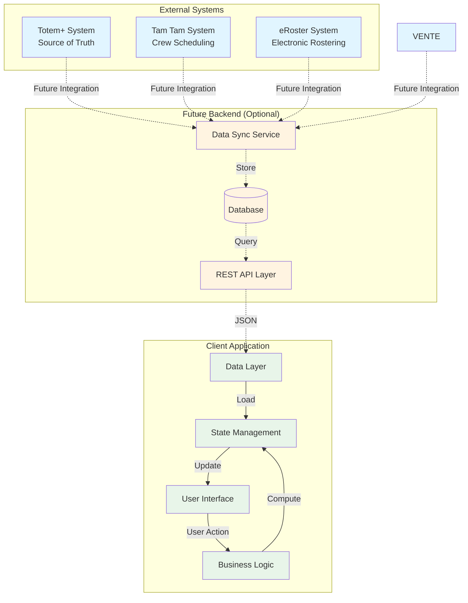
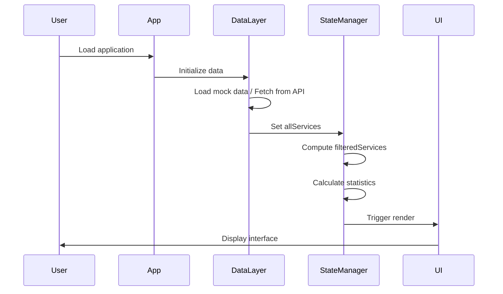
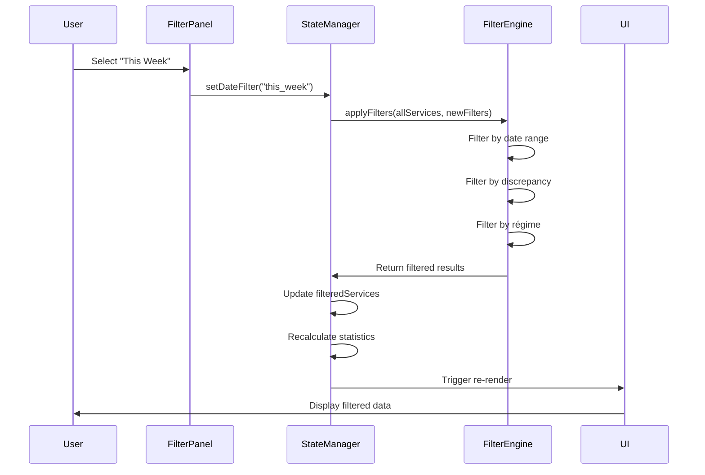
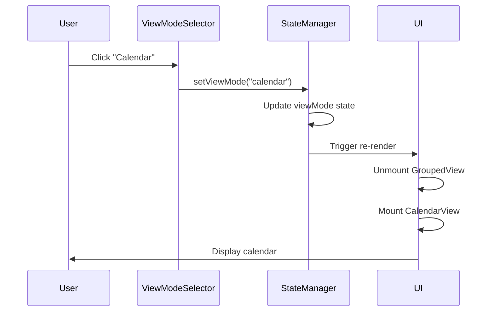
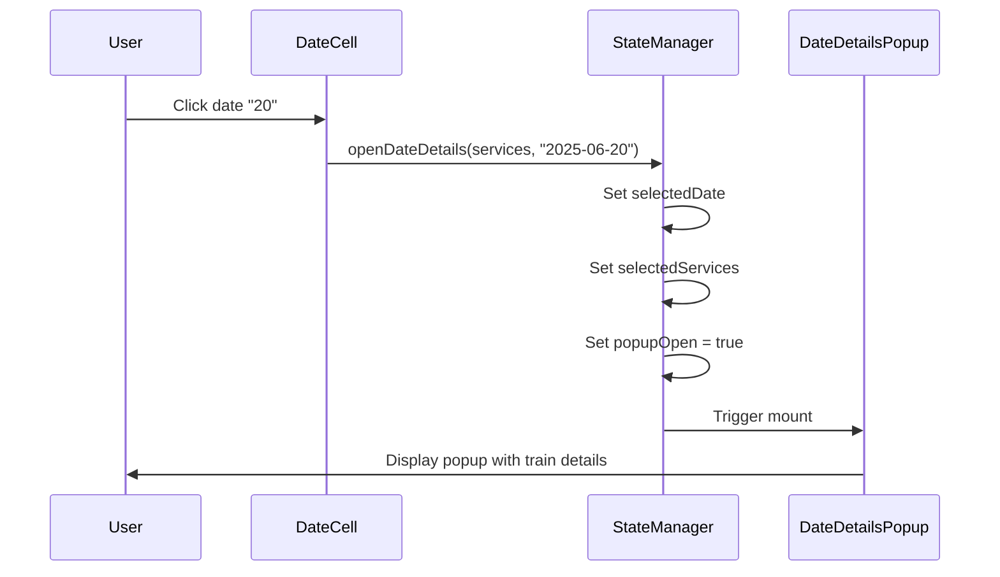
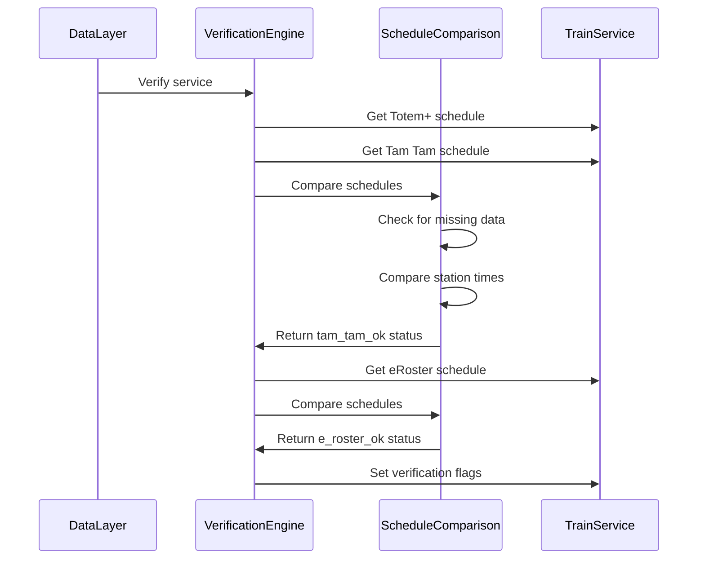
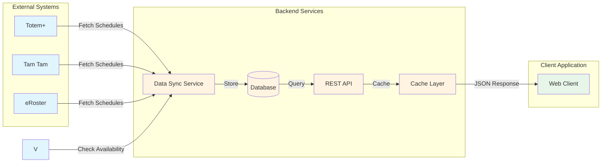
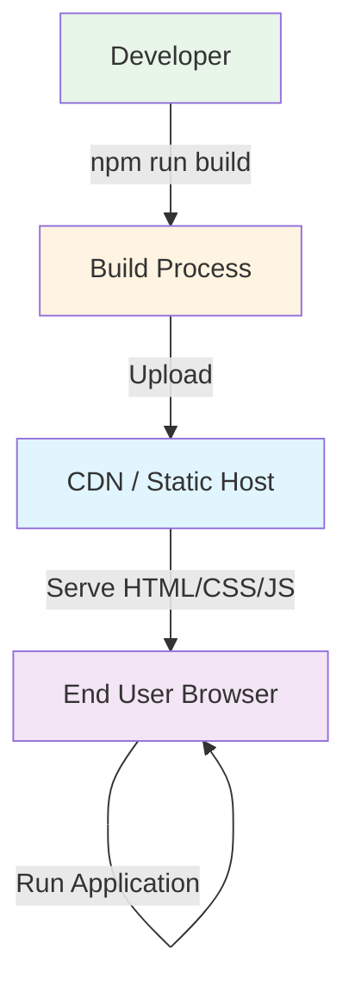
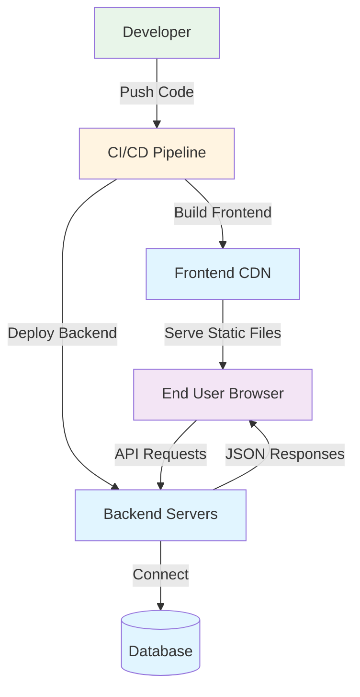

# Train Service Tracking Tool - System Architecture

**Document Version:** 1.0  
**Last Updated:** November 11, 2025  
**Author:** Manus AI

---

## Purpose

This document provides a comprehensive, technology-agnostic specification of the system architecture for the Train Service Tracking Tool. Development teams can use this specification to understand the application's structure, component relationships, data flow, and integration points regardless of their chosen technology stack.

---

## Architecture Overview

The Train Service Tracking Tool follows a **client-side application architecture** with the following characteristics:

- **Deployment Model**: Single-page application (SPA) served as static files
- **Data Source**: Currently uses mock/simulated data; designed for future API integration
- **State Management**: Client-side state with no server-side persistence
- **User Interface**: Responsive web interface with multiple view modes
- **External Systems**: Integrates with three external scheduling systems (Totem+, Tam Tam, eRoster)

---

## High-Level System Architecture




---

## Component Architecture

### Layer 1: Data Layer

The Data Layer is responsible for managing raw data structures and providing data access interfaces.

**Components:**

| Component | Responsibility | Technology-Agnostic Description |
|-----------|---------------|--------------------------------|
| **Data Store** | Holds all train service data | In-memory array/list of TrainService objects |
| **Data Access** | Provides query and filter interfaces | Functions to retrieve, filter, and sort services |
| **Mock Data Generator** | Creates sample data for development | Simulation mode that generates realistic test data |
| **Future API Client** | Fetches data from backend | HTTP client for REST API communication |

**Data Flow:**
1. Application initializes → Load data from source (mock or API)
2. Data Store populates with TrainService objects
3. Components query Data Access layer for filtered/sorted data
4. Data Access returns requested subset to calling components

---

### Layer 2: Business Logic Layer

The Business Logic Layer implements all verification algorithms, filtering logic, and data transformations.

**Components:**

| Component | Responsibility | Implementation |
|-----------|---------------|----------------|
| **Schedule Comparison** | Compares schedules across systems | Functions: `hasTamTamDiscrepancy()`, `hasERosterDiscrepancy()`, `isTamTamMissingData()`, `isERosterMissingData()` |
| **Filter Engine** | Applies user-selected filters | Functions for date range, discrepancy type, and régime filtering |
| **Statistics Calculator** | Computes aggregate metrics | Counts total trains, discrepancies, and system-specific issues |
| **Régime Classifier** | Assigns régime to services | Analyzes service date and pattern to determine régime type |

**Key Algorithms:**

**Schedule Comparison Algorithm:**
```
function compareSchedules(totemSchedule, targetSchedule):
    for each station in route:
        totemTime = totemSchedule.getTime(station)
        targetTime = targetSchedule.getTime(station)
        
        if totemTime exists and targetTime exists:
            if totemTime != targetTime:
                return DISCREPANCY
        
        if totemTime exists and targetTime does not exist:
            return DISCREPANCY
    
    return OK
```

**Missing Data Detection Algorithm:**
```
function isMissingData(schedule):
    hasAnyTime = false
    
    for each station in schedule:
        if station.time exists:
            hasAnyTime = true
            break
    
    return !hasAnyTime
```

**Filter Application Algorithm:**
```
function applyFilters(services, filters):
    result = services
    
    // Apply date range filter
    if filters.dateRange != ALL:
        result = filterByDateRange(result, filters.dateRange)
    
    // Apply discrepancy filter
    if filters.discrepancy != ALL:
        result = filterByDiscrepancy(result, filters.discrepancy)
    
    // Apply régime filter
    result = filterByRegime(result, filters.regimeSelections)
    
    return result
```

---

### Layer 3: State Management Layer

The State Management Layer maintains the application's current state and coordinates updates between components.

**State Structure:**

| State Category | Properties | Description |
|----------------|-----------|-------------|
| **Data State** | `allServices`, `filteredServices`, `regimeTemplates` | All loaded services and filtered subsets |
| **Filter State** | `dateFilter`, `discrepancyFilter`, `regimeFilters`, `customDateRange` | User-selected filter criteria |
| **UI State** | `viewMode`, `expandedDates`, `selectedDate`, `popupOpen` | View mode, expansion states, popup visibility |
| **Configuration State** | `regimeColors` | User-customized régime colors |
| **Statistics State** | `totalTrains`, `totalDiscrepancies`, `systemIssues` | Computed aggregate metrics |

**State Update Flow:**
```
User Action → Event Handler → State Update Function → State Change → UI Re-render
```

**Example State Update:**
```
User clicks "This Week" filter
  ↓
onDateFilterChange("this_week")
  ↓
setDateFilter("this_week")
  ↓
filteredServices recomputes (useMemo/computed property)
  ↓
UI components re-render with new filtered data
```

---

### Layer 4: User Interface Layer

The User Interface Layer renders visual components and handles user interactions.

**Component Hierarchy:**

```
App
├── Header
│   ├── Title
│   └── SimulationToggle
├── MainLayout
│   ├── FilterPanel (Sidebar Left)
│   │   ├── DateRangeFilter
│   │   ├── DiscrepancyFilter
│   │   └── RegimeFilter
│   │       ├── RegimeCheckbox (x7)
│   │       └── ColorPicker (x2)
│   ├── ContentArea (Center)
│   │   ├── ViewModeSelector
│   │   ├── RowExpansionControls
│   │   ├── RegimeSection
│   │   │   └── ScheduleTable (templates)
│   │   ├── GroupedView (conditional)
│   │   │   └── DateGroup (multiple)
│   │   │       ├── DateHeader
│   │   │       └── ScheduleTable
│   │   ├── SpreadsheetView (conditional)
│   │   │   └── ScheduleTable
│   │   └── CalendarView (conditional)
│   │       └── MonthGrid (multiple)
│   │           └── DateCell (multiple)
│   └── StatisticsPanel (Sidebar Right)
│       ├── TotalTrains
│       ├── TotalDiscrepancies
│       ├── TamTamIssues
│       ├── ERosterIssues
│       └── VenteIssues
└── DateDetailsPopup (Modal)
    ├── PopupHeader
    ├── TrainCard (multiple)
    │   ├── TrainHeader
    │   ├── OutboundSchedule
    │   └── ReturnSchedule
    └── Legend
```

**Component Responsibilities:**

| Component | Responsibility | Inputs | Outputs |
|-----------|---------------|--------|---------|
| **FilterPanel** | Display and manage filter controls | Current filter state | Filter change events |
| **ViewModeSelector** | Switch between Grouped/Spreadsheet/Calendar | Current view mode | View mode change event |
| **ScheduleTable** | Render train services in table format | Array of services | Click events on rows |
| **DateGroup** | Collapsible date section in Grouped view | Date, services, expanded state | Toggle expansion event |
| **MonthGrid** | Calendar grid for one month | Month, year, services | Date cell click events |
| **DateCell** | Single date in calendar | Date, services for that date | Click event |
| **DateDetailsPopup** | Modal showing full schedule details | Selected date, services | Close event |
| **StatisticsPanel** | Display aggregate metrics | Filtered services | None (passive display) |

---

## Data Flow Diagrams

### Initialization Flow



### Filter Application Flow



### View Mode Switch Flow



### Calendar Date Click Flow



### Verification Computation Flow



---

## Integration Points

### Current Implementation (Mock Data)

The current implementation uses client-side mock data generation with no external integrations.

**Mock Data Source:**
- Hardcoded sample services in `client/src/data/trainData.ts`
- Simulation mode toggle generates additional random services
- No persistence between sessions

### Future Backend Integration

The architecture is designed to support future backend integration with minimal changes to the UI layer.

**Proposed Integration Architecture:**



**Required Backend Components:**

1. **Data Sync Service**
   - Periodically fetches data from Totem+, Tam Tam, and eRoster
   - Normalizes data into common format
   - Stores in database with timestamps

2. **REST API**
   - Provides endpoints for querying train services
   - Supports filtering by date range, train number, régime
   - Returns JSON responses matching current data model

3. **Database**
   - Stores normalized train service data
   - Maintains historical records
   - Supports efficient querying

4. **Cache Layer**
   - Reduces database load for frequently accessed data
   - Invalidates on data updates
   - Improves response times

**API Endpoints (Proposed):**
- `GET /api/services?start_date={date}&end_date={date}` - Get services by date range
- `GET /api/services/{service_id}` - Get single service details
- `GET /api/services/train/{train_number}` - Get all instances of a train
- `GET /api/regimes` - Get régimé template services
- `GET /api/statistics?start_date={date}&end_date={date}` - Get aggregate statistics

---

## Deployment Architecture

### Current Deployment (Static SPA)



**Deployment Steps:**
1. Developer builds application (compiles, bundles, optimizes)
2. Static files (HTML, CSS, JavaScript) uploaded to hosting service
3. CDN serves files to users
4. Application runs entirely in user's browser

**Hosting Options:**
- Static file hosting (Netlify, Vercel, GitHub Pages)
- CDN with origin server
- Object storage with web hosting (S3, Azure Blob)

### Future Deployment (Full Stack)



---

## Technology Stack Recommendations

While the architecture is technology-agnostic, here are recommended technology options for different scenarios:

### Option 1: Modern JavaScript Stack

| Layer | Technology | Rationale |
|-------|-----------|-----------|
| Frontend Framework | React, Vue, or Angular | Component-based architecture, strong ecosystem |
| State Management | Redux, Zustand, or Pinia | Centralized state with predictable updates |
| UI Components | Material-UI, Ant Design, or shadcn/ui | Pre-built accessible components |
| Build Tool | Vite or Webpack | Fast development and optimized production builds |
| Backend (Future) | Node.js + Express | JavaScript across stack, easy JSON handling |
| Database (Future) | PostgreSQL or MongoDB | Relational or document-based depending on needs |

### Option 2: Enterprise .NET Stack

| Layer | Technology | Rationale |
|-------|-----------|-----------|
| Frontend Framework | Blazor or Angular | Strong typing, enterprise support |
| State Management | Fluxor or NgRx | Predictable state management patterns |
| UI Components | Telerik or DevExpress | Enterprise-grade component libraries |
| Backend | ASP.NET Core Web API | High performance, strong typing, mature ecosystem |
| Database | SQL Server or PostgreSQL | Enterprise-grade relational database |
| ORM | Entity Framework Core | Type-safe database access |

### Option 3: Python/Django Stack

| Layer | Technology | Rationale |
|-------|-----------|-----------|
| Frontend Framework | React or Vue | Modern SPA capabilities |
| Backend | Django REST Framework | Rapid development, built-in admin |
| Database | PostgreSQL | Robust relational database |
| Task Queue (Future) | Celery | Background data sync jobs |
| Cache | Redis | Fast caching for API responses |

---

## Scalability Considerations

### Current Scale (Mock Data)

- **Data Volume**: ~40 services (mock data)
- **Users**: Single user (no multi-tenancy)
- **Performance**: Instant (all client-side)

### Future Scale Projections

**Anticipated Growth:**
- **Data Volume**: 1,000+ services per month, 12,000+ per year
- **Users**: 10-50 concurrent users
- **API Requests**: 100-500 requests per minute

**Scalability Strategies:**

1. **Client-Side Optimization**
   - Implement virtual scrolling for large tables
   - Lazy load calendar months
   - Debounce filter inputs

2. **Backend Optimization**
   - Index database on frequently queried fields (date, train_number, regime)
   - Implement pagination for large result sets
   - Cache frequently accessed data (régimé templates, statistics)

3. **Infrastructure Scaling**
   - Horizontal scaling of API servers
   - Database read replicas for query distribution
   - CDN for static asset delivery

---

## Security Considerations

### Current Implementation

- **Authentication**: None (public access)
- **Authorization**: None (all data visible)
- **Data Validation**: Client-side only

### Future Security Requirements

**Authentication & Authorization:**
- User login with role-based access control
- Different permission levels (viewer, editor, admin)
- Session management with secure tokens

**Data Security:**
- HTTPS for all communications
- Input validation on both client and server
- SQL injection prevention through parameterized queries
- XSS protection through output encoding

**API Security:**
- Rate limiting to prevent abuse
- API key or OAuth for external integrations
- CORS configuration for allowed origins

---

## Summary

The Train Service Tracking Tool architecture is designed with the following principles:

- **Separation of Concerns**: Clear boundaries between data, logic, state, and UI layers
- **Technology Agnostic**: Core concepts applicable to any modern framework
- **Future-Ready**: Designed to accommodate backend integration with minimal refactoring
- **Scalable**: Architecture supports growth in data volume and user count
- **Maintainable**: Component-based structure with well-defined responsibilities

Development teams can implement this architecture using their preferred technology stack while maintaining consistency with the documented design patterns, data flows, and component relationships.

---

**End of Document**
