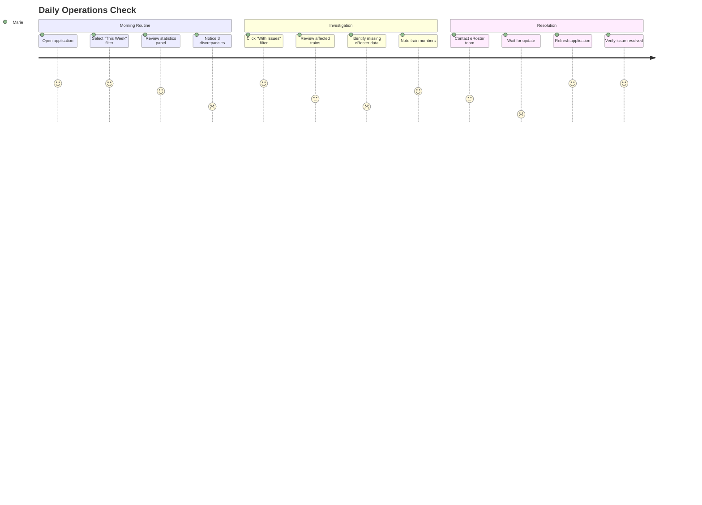
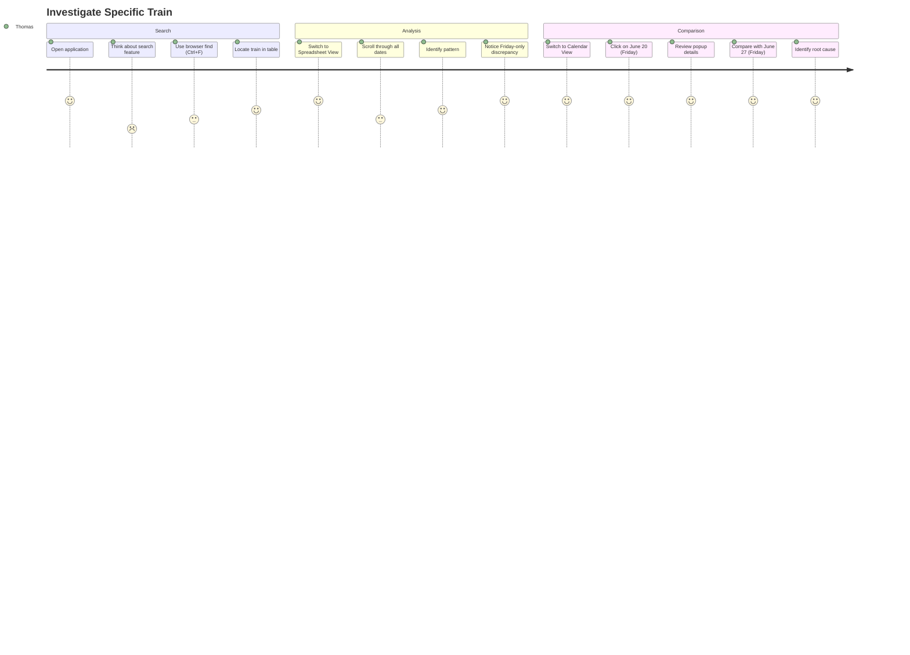
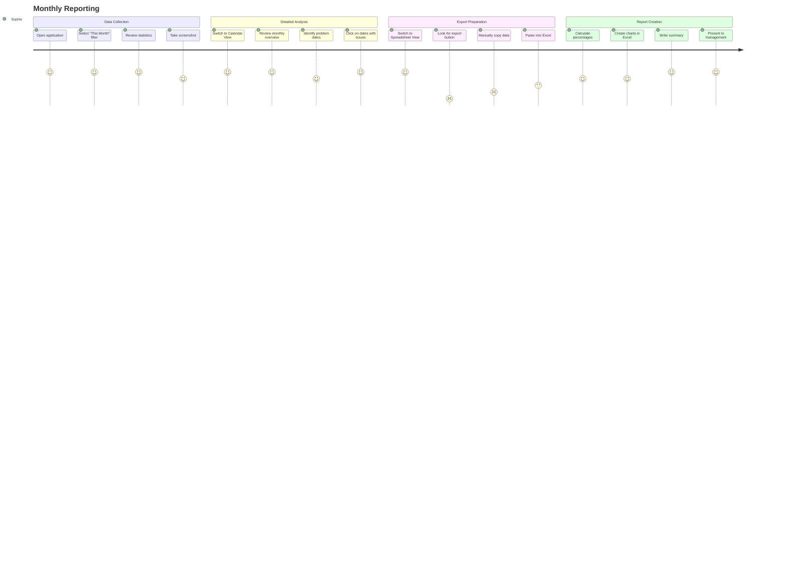
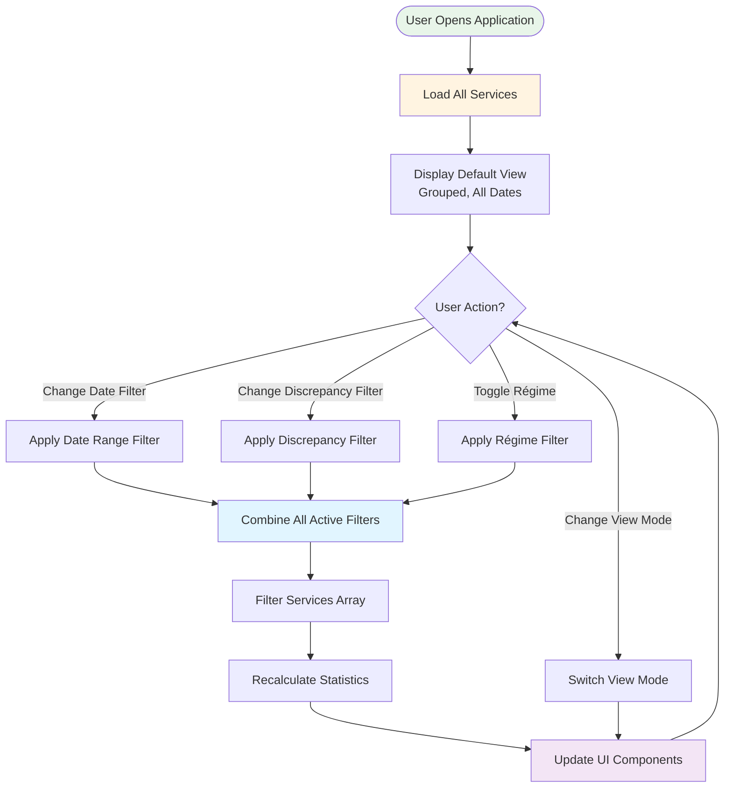
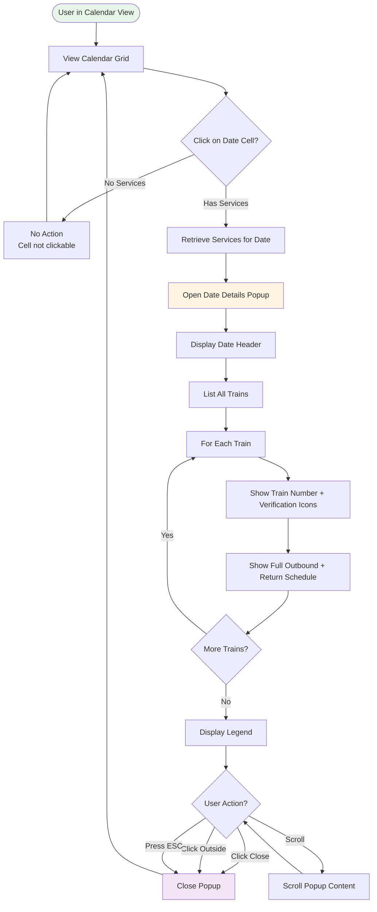
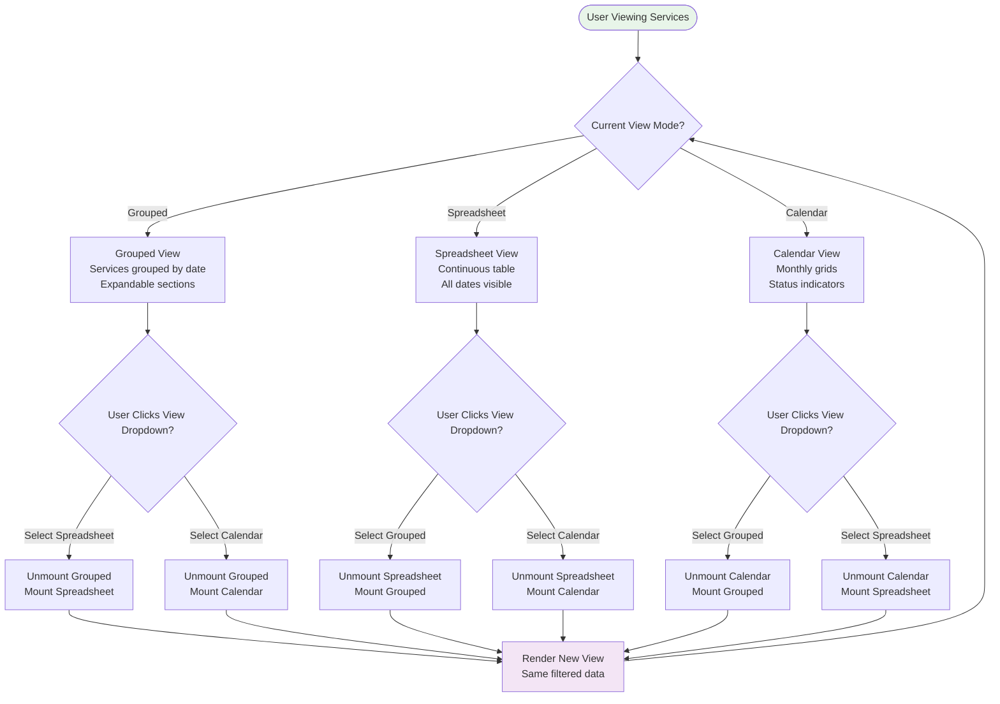
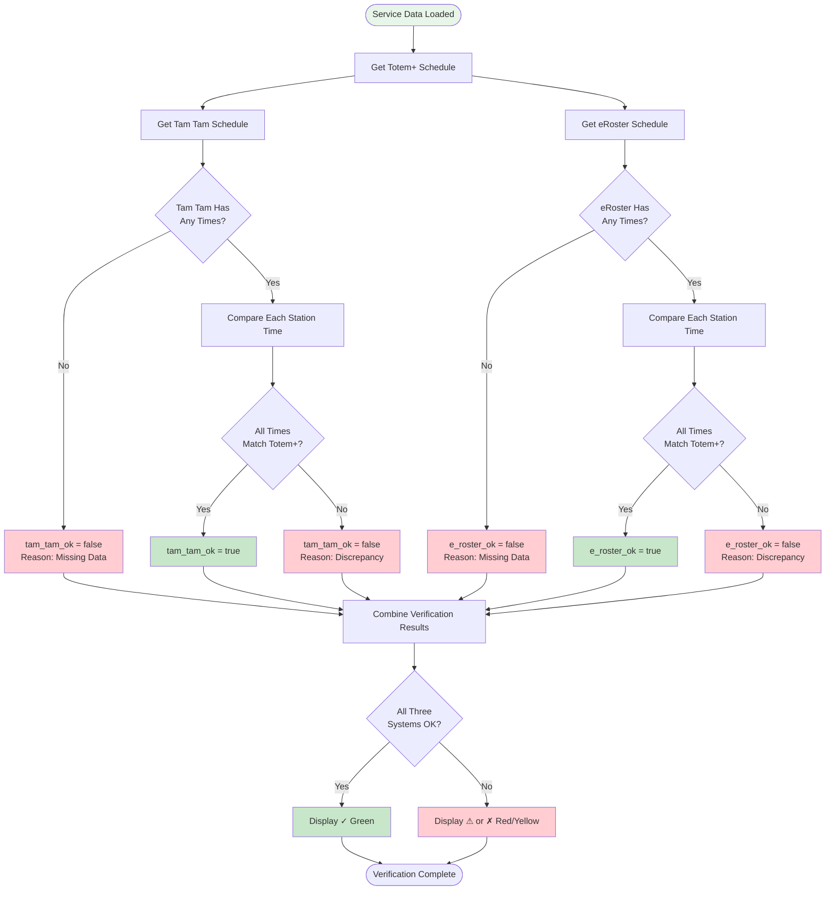

# Train Service Tracking Tool - User Journeys & Workflows

**Document Version:** 1.0  
**Last Updated:** November 11, 2025  
**Author:** Manus AI

---

## Purpose

This document provides comprehensive user journey maps and workflow diagrams for the Train Service Tracking Tool. Development teams can use these journeys to understand user goals, pain points, and interaction patterns when implementing the application in any technology stack.

---

## User Personas

### Persona 1: Operations Manager (Marie)

**Role:** Oversees daily train operations and crew scheduling

**Goals:**
- Quickly identify schedule discrepancies between systems
- Ensure all trains have verified schedules before operation
- Monitor overall system health and verification rates

**Pain Points:**
- Manual cross-checking of three different systems is time-consuming
- Missing data in eRoster causes crew assignment issues
- Needs to report discrepancies to stakeholders

**Technical Proficiency:** Moderate (comfortable with web applications)

---

### Persona 2: Schedule Coordinator (Thomas)

**Role:** Maintains and updates train schedules across systems

**Goals:**
- Find specific trains with verification issues
- Compare schedules across different dates
- Track which services need attention

**Pain Points:**
- Difficult to find patterns in discrepancies
- Needs to verify hundreds of services per month
- Must coordinate updates across multiple systems

**Technical Proficiency:** High (power user, uses keyboard shortcuts)

---

### Persona 3: Executive Analyst (Sophie)

**Role:** Generates reports for senior management

**Goals:**
- Extract high-level statistics and trends
- Create reports showing verification rates over time
- Identify systemic issues requiring process improvements

**Pain Points:**
- Needs data in exportable formats
- Requires historical trend analysis
- Must present findings to non-technical stakeholders

**Technical Proficiency:** Moderate (focuses on data analysis, not technical details)

---

## User Journey Maps

### Journey 1: Daily Operations Check (Marie)

**Scenario:** Marie arrives at work and needs to verify that all trains scheduled for today have correct schedules in all systems.

**Journey Steps:**

**Detailed Workflow:**

1. **Application Launch**
   - Marie opens the Train Service Tracking Tool in her browser
   - Application loads with default view (Grouped View, All Dates)
   - Statistics panel shows overview of all services

2. **Filter to Current Week**
   - Marie clicks on the "Date Range" dropdown in the left sidebar
   - Selects "This Week" option
   - Application immediately filters to show only services for current week (Sunday-Saturday)
   - Statistics panel updates to show: "Total Trains: 28, Total Discrepancies: 3"

3. **Identify Issues**
   - Marie notices "Total Discrepancies: 3" in the statistics panel
   - Clicks "With Issues" in the "Discrepancy Filter" section
   - Application filters to show only the 3 services with verification problems
   - Grouped View displays services organized by date

4. **Investigate Discrepancies**
   - Marie expands the date group for "June 20, 2025"
   - Sees Train 9339 has a red "✗" in the eRoster column
   - Hovers over the "✗" icon to see tooltip: "Missing data - System has no schedule"
   - Notes train number and date for follow-up

5. **Contact Responsible Team**
   - Marie sends email to eRoster team with train numbers and dates
   - Includes screenshot from application showing missing data

6. **Verify Resolution**
   - After receiving confirmation from eRoster team, Marie refreshes the application
   - Filters again to "With Issues"
   - Verifies that the discrepancy count has decreased
   - Switches back to "All Trains" to confirm overall status

**Success Metrics:**
- Time to identify all discrepancies: < 2 minutes
- Time to document issues for follow-up: < 5 minutes
- Confidence in data accuracy: High

---

### Journey 2: Schedule Verification for Specific Train (Thomas)

**Scenario:** Thomas receives a report that Train 9376 has inconsistent schedules. He needs to investigate all instances of this train across multiple dates.

**Journey Steps:**

**Detailed Workflow:**

1. **Application Launch**
   - Thomas opens the application
   - Default view shows all services in Grouped View

2. **Attempt to Find Train**
   - Thomas looks for a search box (not currently available)
   - Uses browser's built-in search (Ctrl+F or Cmd+F)
   - Types "9376" to find instances of Train 9376
   - Browser highlights matching text in the table

3. **Switch to Spreadsheet View**
   - Thomas clicks "View" dropdown in the header
   - Selects "Spreadsheet" option
   - Application displays all services in a continuous table
   - Thomas can now see all instances of Train 9376 across different dates

4. **Analyze Pattern**
   - Thomas scrolls through the spreadsheet
   - Notices Train 9376 appears on June 20, 27, July 4, 11, 18, 25 (all Fridays)
   - Observes that eRoster column shows "✗" only on July 11 and July 18
   - Hypothesizes this might be a recurring issue for specific Fridays

5. **Detailed Investigation in Calendar View**
   - Thomas switches to Calendar View
   - Navigates to June 2025
   - Clicks on June 20 (Friday with no issues)
   - Popup displays full schedule details for all trains on that date
   - Reviews Train 9376's complete outbound and return journey times
   - Closes popup

6. **Compare with Problematic Date**
   - Thomas scrolls to July 2025 in Calendar View
   - Clicks on July 11 (Friday with eRoster issue)
   - Popup shows Train 9376 with "✗" in eRoster column
   - Notices eRoster schedule is completely empty (all times null)
   - Compares with Totem+ schedule which has full journey details

7. **Document Findings**
   - Thomas notes that eRoster is missing data for Train 9376 on specific Fridays in July
   - Prepares report for eRoster team with specific dates and train number
   - Recommends systematic check of all Friday services in July

**Success Metrics:**
- Time to locate all instances of train: < 3 minutes
- Ability to compare across dates: High
- Clarity of discrepancy visualization: High

---

### Journey 3: Monthly Reporting (Sophie)

**Scenario:** Sophie needs to prepare a monthly report for management showing verification rates and trends for June 2025.

**Journey Steps:**

**Detailed Workflow:**

1. **Application Launch and Filter**
   - Sophie opens the application on the last day of June
   - Clicks "Date Range" dropdown
   - Selects "This Month" to filter to June 2025 services
   - Statistics panel updates to show June-specific metrics

2. **Capture High-Level Statistics**
   - Sophie reviews the Statistics Panel:
     - Total Trains: 16
     - Total Discrepancies: 4
     - Tam Tam Issues: 1
     - eRoster Issues: 3
   - Takes screenshot of statistics panel for report

3. **Calendar Overview**
   - Sophie switches to Calendar View
   - Sees June 2025 calendar with visual status indicators
   - Identifies dates with issues: June 27 (shows TT ⚠, eR ✓, V ⚠)
   - Clicks on June 27 to see detailed popup
   - Notes which specific trains had issues on that date

4. **Detailed Data Collection**
   - Sophie switches to Spreadsheet View
   - Looks for an export button (not currently available)
   - Manually selects table data with mouse
   - Copies to clipboard (Ctrl+C)
   - Pastes into Excel spreadsheet

5. **Data Analysis in Excel**
   - Sophie calculates verification rates:
     - Tam Tam: 93.75% (15/16 verified)
     - eRoster: 81.25% (13/16 verified)
     - Overall: 75% (12/16 fully verified)
   - Creates bar chart showing verification rates by system
   - Creates trend line comparing to previous months (from historical data)

6. **Report Writing**
   - Sophie writes executive summary highlighting:
     - Overall verification rate of 75% for June
     - eRoster continues to be the weakest link (81.25% vs 93.75% for others)
     - Recommendation to prioritize eRoster data quality improvements
   - Includes screenshots from application showing calendar view and statistics

**Success Metrics:**
- Time to collect data: 10 minutes (would be < 2 minutes with export feature)
- Data accuracy: High
- Report clarity: High

**Pain Points Identified:**
- No export functionality (requires manual copy-paste)
- No built-in trend analysis (requires external tools)
- No historical data comparison within application

---

## Workflow Diagrams

### Workflow 1: Filter Application Flow

---

### Workflow 2: Calendar Date Click Flow

---

### Workflow 3: View Mode Switching Flow

---

### Workflow 4: Verification Status Computation Flow

---

## Feature Usage Patterns

### Pattern 1: Quick Daily Check

**User Goal:** Verify that today's trains are all OK

**Steps:**
1. Open application
2. Select "This Week" filter
3. Check statistics panel for "Total Discrepancies"
4. If 0, done (< 30 seconds)
5. If > 0, click "With Issues" to investigate

**Frequency:** Daily (every morning)

**User Type:** Operations Manager

---

### Pattern 2: Investigate Specific Issue

**User Goal:** Understand why a specific train has a discrepancy

**Steps:**
1. Open application
2. Use browser search (Ctrl+F) to find train number
3. Switch to Spreadsheet View for better visibility
4. Locate train in table
5. Check which system has the issue (✓, ⚠, or ✗)
6. Compare Totem+ times with problematic system
7. Document discrepancy for follow-up

**Frequency:** As needed (when issues reported)

**User Type:** Schedule Coordinator

---

### Pattern 3: Monthly Overview

**User Goal:** Get high-level view of verification status for the month

**Steps:**
1. Open application
2. Select "This Month" filter
3. Switch to Calendar View
4. Visually scan for dates with issues (red/yellow indicators)
5. Click on problematic dates to see details
6. Take screenshots for reporting

**Frequency:** Monthly (end of month)

**User Type:** Executive Analyst

---

### Pattern 4: Régime-Specific Analysis

**User Goal:** Check verification status for Friday services only

**Steps:**
1. Open application
2. Uncheck all régimes except "Vendredi" in Régime Filter
3. Select appropriate date range
4. Review filtered results in preferred view mode
5. Check statistics panel for Vendredi-specific metrics

**Frequency:** Weekly (for specific régime reviews)

**User Type:** Schedule Coordinator

---

## Pain Points and Improvement Opportunities

### Current Pain Points

1. **No Train Number Search**
   - Users must use browser's built-in search (Ctrl+F)
   - Cannot filter to show only specific train numbers
   - **Improvement:** Add search box in header to filter by train number

2. **No Data Export**
   - Users must manually copy-paste data into Excel
   - Time-consuming for large datasets
   - **Improvement:** Add "Export to CSV" or "Export to Excel" button

3. **No Historical Trends**
   - Cannot compare current month to previous months
   - No trend visualization
   - **Improvement:** Add historical data storage and trend charts

4. **Limited Sorting Options**
   - Services always sorted by train number
   - Cannot sort by verification status or other criteria
   - **Improvement:** Add sortable column headers in Spreadsheet View

5. **No Bulk Actions**
   - Cannot mark multiple services as reviewed
   - Cannot assign follow-up tasks
   - **Improvement:** Add checkboxes and bulk action toolbar

---

## Success Metrics

### Application Performance Metrics

| Metric | Target | Current |
|--------|--------|---------|
| Time to load application | < 2 seconds | ✓ Achieved |
| Time to apply filter | < 500ms | ✓ Achieved |
| Time to switch view mode | < 300ms | ✓ Achieved |
| Time to open calendar popup | < 200ms | ✓ Achieved |

### User Task Completion Metrics

| Task | Target Time | Current Time |
|------|-------------|--------------|
| Daily operations check | < 2 minutes | ✓ Achieved |
| Find specific train | < 1 minute | 2-3 minutes (needs search) |
| Investigate discrepancy | < 5 minutes | ✓ Achieved |
| Monthly report preparation | < 10 minutes | 15-20 minutes (needs export) |

### User Satisfaction Metrics

| Aspect | Target Score (1-5) | Estimated Current |
|--------|-------------------|-------------------|
| Ease of use | 4.5 | 4.0 |
| Visual clarity | 4.5 | 4.5 |
| Feature completeness | 4.0 | 3.5 |
| Performance | 4.5 | 4.5 |

---

## Summary

These user journey maps and workflows provide a comprehensive understanding of how users interact with the Train Service Tracking Tool. Development teams can use this documentation to:

- **Understand User Goals**: Design features that directly support user objectives
- **Identify Pain Points**: Prioritize improvements that address current limitations
- **Optimize Workflows**: Streamline common tasks to reduce time and effort
- **Measure Success**: Track metrics that matter to actual users

The journeys demonstrate that the application successfully supports core use cases (daily checks, issue investigation, monthly reporting) while also highlighting opportunities for enhancement (search, export, historical trends) that would significantly improve user productivity.

---

**End of Document**
